# Persistence

## Data Persistence in .NET Applications

<div class="right">[ Jan Pluskal &lt;ipluskal@fit.vutbr.cz&gt;  ]</div>

---

## Lecture Outline
1. What is persistence and how to achieve it?
2. Object relationship mapping (ORM)
3. ORM using Entity Framework Core
4. Persistence architectural patterns
5. How to setup Entity Framework Core
6. `Repository` and `UnitOfWork` Patterns

---

## Basic Terms
 <!-- .element: class="overview" -->
* **Software framework**
* **Database**
  * Database components, types
  * Persistence
  * Visual Studio Server Explorer
  * Object-relational mapping
  * ACID, SQL, CAP, CRUD, DAL, DBMS...


---

## Software Framework
* **Abstraction** providing **generic functionality**
* Can be selectively changed by additional user-written code
  * Providing application-specific software
* **Universal, reusable software environment**
  * Provides particular functionality as part of a larger software platform
    * To facilitate development of software applications

---

## Database
* **Persistent** data storage
* **Store**, **organize**, and **process information**
  * Query, Sort, Transform
* Can be **searched**, **referenced**, **compared**, **changed** or otherwise manipulated
* The goal is to have **Optimal speed** and **minimal processing expense**
* **Database management system (DBMS)**
  * System specifically designed to hold databases

+++
### Database components
* *Schema* - formal definition of database structure
* *Table* - contains multiple columns (similar to the columns in a spreadsheet)
* *Column* - contains one of several types of data
* *Row* - **data** in a table is listed in rows (like rows of data in a spreadsheet)

+++
### Persistence
* **Official definition**
  * *The continuance of an effect after its cause is removed*
  * *Information survives after the process with which it was created has ended*
* **In database context**
  * *Data is available after application or system reboot*

+++
### ACID
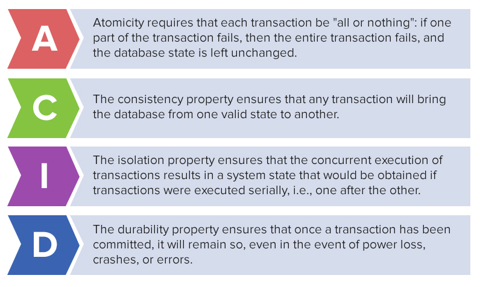 <!-- .element: class="r-stretch" -->

+++
### CAP
 <!-- .element: class="r-stretch" -->

+++
### CRUD
 <!-- .element: class="r-stretch" -->

+++
### Data Access Layer (DAL)
<div id="left">

* **Definition**
  * *Layer of a computer program which provides simplified access to data stored in persistent storage*
* DAL might **return a reference to an object complete with its attributes**
* Created higher level of abstraction
</div>

<div id="right">

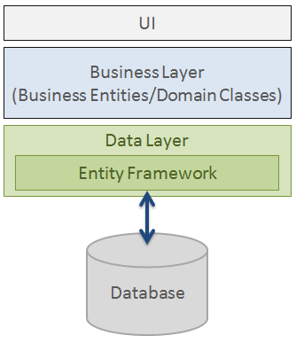 <!-- .element: class="r-stretch" -->
</div>

+++
## Database Types
<div id="left">

* *Relational (SQL)* databases
    * e.g., MySQL, PostgresSQL, MS SQL, Oracle, ...
    * Each table has firm structure
    * Relation validations
</div>


<div id="right">

* *NoSQL* databases
    * e.g., MongoDB, Cassandra, ...
    * Not-only-SQL
    * May/MayNot enforced schema
    * Typically faster read/write operations
</div>


*  *Single-File* vs *Multi-File* databases
*  *Object Oriented* databases


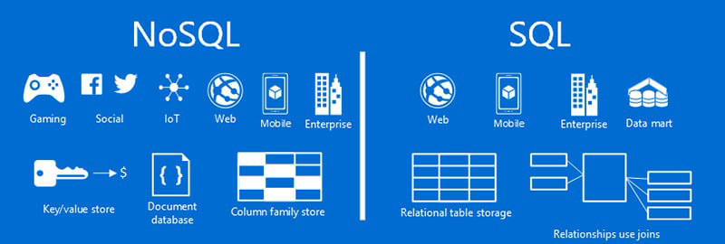


+++
### SQL
* **Structured Query Language**
* Standard language for relational database management systems
  
<div id="left">

   <!-- .element height="100%" width="100%" -->

</div>


<div id="right">

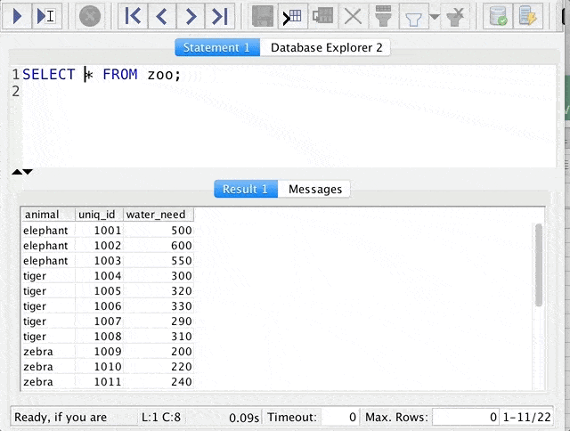  <!-- .element height="100%" width="100%" -->


+++
### Microsoft SQL LocalDB
* Feature of *SQL Server Express*
* Designed for developers
* **Minimal set of files necessary** to start the SQL Server Database Engine
* Initiate a connection using a special *connection string*
* When connecting, the **necessary SQL Server infrastructure is automatically created and started**
* Enabling the application to **use the database without complex configuration** tasks

+++
### Visual Studio Server Explorer

<div id="left">

* **Server management** console for *Visual Studio**
* **Open data connections**
* **Log on to servers**
  * **Explore their databases and system services**
* *View -> Server Explorer*

</div>

<div id="right">

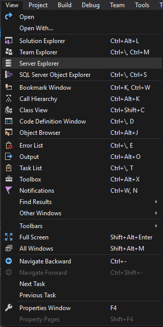

</div>

+++
### Connect to MSSQLLocalDB
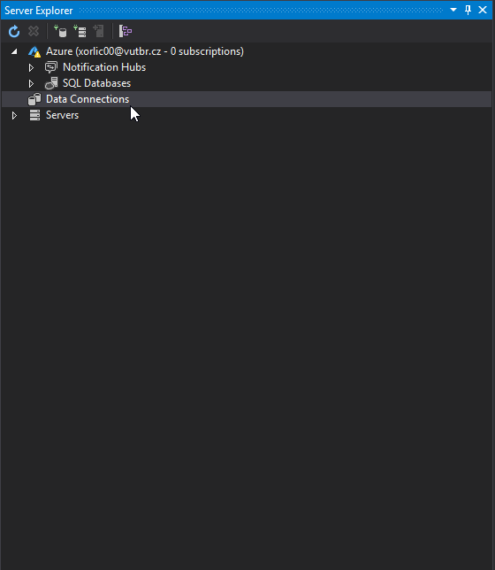

+++
## Object-relational Mapping (ORM)
<div id="left">

* *Programming technique*
  * **Converting data between incompatible type systems**
  * Using object-oriented programming languages
* *Table row to the object*
* Creates "*virtual object database*"
* Can be used from within the programming language
</div>

<div id="right">

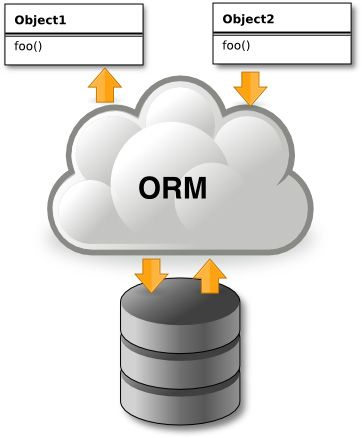
</div>

+++
### Pros of Object Relation Mapping
* **Abstract**
* **Portable**
* Writing code in **one language** (ORM takes care of vendor specific code by itself)
* **Code reduction** (most of the time)
* **Cache management**
  * Entities are cached in memory (reducing load on the database)

+++
### Cons of Object Relation Mapping
* Maybe **Slow** in some scenarios
* **Complex queries take time**
  * Minimize the DBMS hits
  * Reduce bad queries which hurts performance
* **Limitations** if complex queries are needed
  * Sometimes it is faster to write raw SQL

---
## Technologies used to connect to the database
 <!-- .element: class="overview" -->

* **ADO.NET**
* **Entity Framework** (used in this course)
* **Dapper**
* **NHibernate**
* ⋮
* [NuGetMustHaves.com - Top ORM Packages](https://nugetmusthaves.com/Category/ORM)


+++
## ADO.NET
* Set of classes that **expose data access service**
  * *SqlClient* (`System.Data.SqlClient`)
  * *OleDb* (`System.Data.OleDb`)
  * *Odbc* (`System.Data.Odbc`)
  * ⋮
* Providing **access to relational data, XML, and application data**
* Supports a variety of development needs
  * Creation of front-end **database clients**
  * Middle-tier business objects used by applications, tools, languages, or Internet browsers

+++

<pre><code  data-sample='assets/sln/Examples/SqlClientExample.cs' data-sample-line-numbers="true" data-sample-indent="remove"></code></pre>
<!-- +++?code=assets/sln/Examples/SqlClientExample.cs&lang=C#&title=ADO.NET SqlClient Sample
@[10-53]
@[10-12]
@[14-18]
@[20-21]
@[23-26]
@[28-30]
@[32-50]
@[10-53] -->
[Code sample](https://github.com/nesfit/ICS/blob/master/Lectures/Lecture_04/assets/sln/Examples/SqlClientExample.cs)

---
## Entity Framework (EF)
* **Official definition:** *“Entity Framework is an object-relational mapper (ORM) that enables .NET developers to work with a database using .NET objects. It eliminates the need for most of the data-access code that developers usually need to write.”*
* **Object-relational mapping framework**
* By Microsoft
* Enhancement to *ADO.NET*
* To automate all database related activities for your application
* Higher level of abstraction when dealing with data
* Enables to work with data using objects without focusing on the underlying database
* [Tutorial](http://www.entityframeworktutorial.net)

+++
### Entity Framework Main Features
* **Cross-platform** - EF Core is a cross-platform framework (Windows, Linux, Mac)
* **Modelling** - creates an Entity Data Model (EDM) based on Plain Old CLR Object (POCO) entities with get/set properties of different data types (used when querying or saving entity data)
* **Querying** - allows to use LINQ queries
* **Change Tracking** - keeps track of changes occurred to instances of your entities 
* **Saving** - executes commands to the database based on the changes occurred to your entities 
* **Concurrency** - uses Optimistic Concurrency by default to protect overwriting changes made by another user since data was fetched from the database
* **Transactions** - automatic customizable transaction management
* **Caching** - includes first level of caching out of the box (repeated querying will return data from the cache)
* **Built-in Conventions** - follows conventions over the configuration programming pattern, and includes a set of default rules which automatically configure the EF model
* **Configurations** - allows us to configure the EF model by using data annotation attributes or Fluent API to override default conventions
* **Migrations** - set of migration commands to create or manage underlying database Schema

+++
### Entity Framework Versions
* [Differences](https://docs.microsoft.com/en-us/ef/efcore-and-ef6/)
* Currently, there are two latest versions of Entity Framework
* **Entity Framework**
  * Current version 6.x
  * "Old framework"
  * Works only on .NET Framework
* **Entity Framework Core**
  * open-source
  * Current version 6.0.x
  * Works on .NET Standard (supports .NET Core / .NET 6 -->  multiplatform)
  * Used in this course

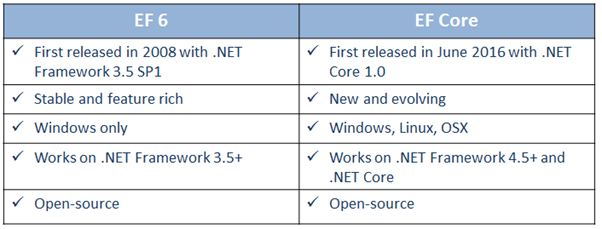

+++
### Entity Framework Core
* [GitHub](https://github.com/aspnet/EntityFrameworkCore)
* [Documentation](https://docs.microsoft.com/sk-sk/ef/core/)
* Is not a part of *.NET*,  *.NET Core* or *Standard*
* Intended to be used with *.NET* applications
* Can also be used with standard *.NET Framework 4.5+* based applications
* Supported application types:

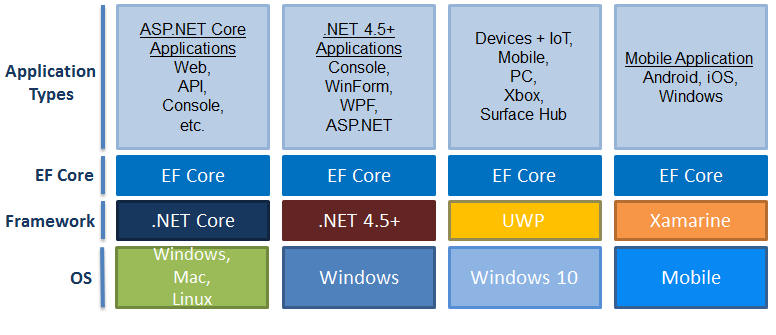

+++
### Approaches
* **Entity Framework Database First**
  * Creating Entity Data Model from your existing database
  * [EF Core Power Tools](https://marketplace.visualstudio.com/items?itemName=ErikEJ.EFCorePowerTools) may help a lot!
* **Entity Framework Code First**
  * *Used in this course*
  * Creates the database based on your domain classes and configuration
  * Write entities in C# and then EF will create the database from the code for you

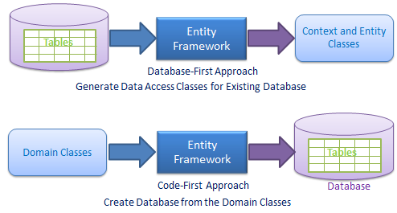


+++
### Data Providers
* Provider model to access many different databases
* NuGet packages which you need to install

|  Database   | NuGet Package                                                                                                     |
| :---------: | :---------------------------------------------------------------------------------------------------------------- |
| SQL Server  | [Microsoft.EntityFrameworkCore.SqlServer](https://www.nuget.org/packages/Microsoft.EntityFrameworkCore.SqlServer) |
|    MySQL    | [MySql.Data.EntityFrameworkCore](https://www.nuget.org/packages/MySql.Data.EntityFrameworkCore)                   |
| PostgreSQL  | [Npgsql.EntityFrameworkCore.PostgreSQL](https://www.nuget.org/packages/Npgsql.EntityFrameworkCore.PostgreSQL)     |
|   SQLite    | [Microsoft.EntityFrameworkCore.SQLite](https://www.nuget.org/packages/Microsoft.EntityFrameworkCore.SQLite)       |
| SQL Compact | [EntityFrameworkCore.SqlServerCompact40](https://www.nuget.org/packages/EntityFrameworkCore.SqlServerCompact40)   |
|  In-memory  | [Microsoft.EntityFrameworkCore.InMemory](https://www.nuget.org/packages/Microsoft.EntityFrameworkCore.InMemory)   |

---
### Installation
 <!-- .element: class="overview" -->
* Install *NuGet* packages to use EF Core
  * **EF Core DB provider**
  * **EF Core tools**
  * **EF Core design**


+++
### Install DB Provider
* Install *NuGet package* for the provider of the database we want to access
* To access **MS SQL Server database**
  * We need to install `Microsoft.EntityFrameworkCore.SqlServer`
    * Tools -> NuGet Package Manager -> Manage NuGet Packages For Solution
    * OR `PM> Install-Package Microsoft.EntityFrameworkCore.SqlServer`

+++
### Install DB Provider Image 1/5
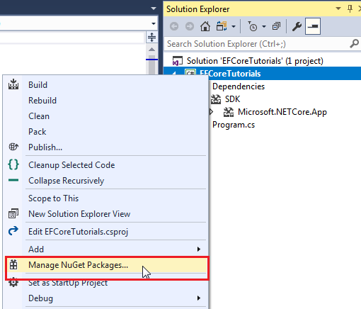
+++
### Install DB Provider Image 2/5
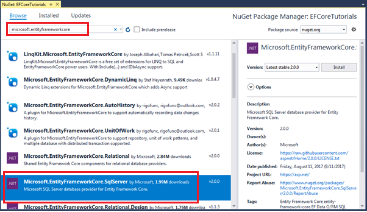
+++
### Install DB Provider Image 3/5
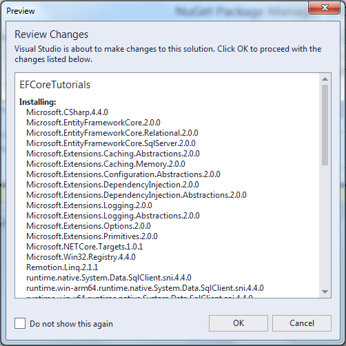
+++
### Install DB Provider Image 4/5
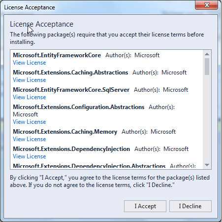
+++
### Install DB Provider Image 5/5
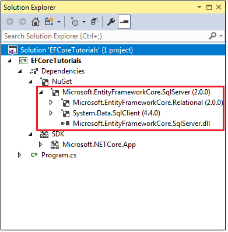

+++
### Install Tools
* To execute EF Core commands
* Makes it easier to perform several EF Core-related tasks in your project at design time
  * E.g. migrations, scaffolding etc.
* Available as NuGet packages
  * For **Package Manager Console** (PMC) as `Microsoft.EntityFrameworkCore.Tools`
  * For **Command Line Interface** (CLI) as `Microsoft.EntityFrameworkCore.Tools.DotNet`

+++
### Install Tools Image
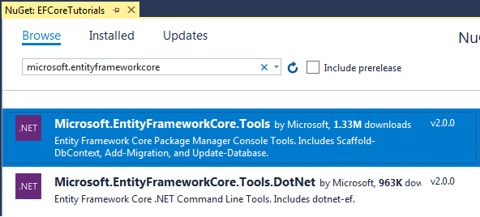

+++
### Install Design
* Shared **design-time components** for Entity Framework Core tools
* Package manager console cmdlets like `Add-Migration`, `dotnet ef` & `ef.exe`
* Needed for **Migrations** or **Reverse Engineering**
* NuGet package `Microsoft.EntityFrameworkCore.Design`

---
## Basic Concepts
 <!-- .element: class="overview" -->
* DbContext
* Entity
* Persitence Scenarios
* Conventions
* Entity Configurations
* Entity Relationships
* RAW SQL Queries
* Migrations

+++
### Example Schema
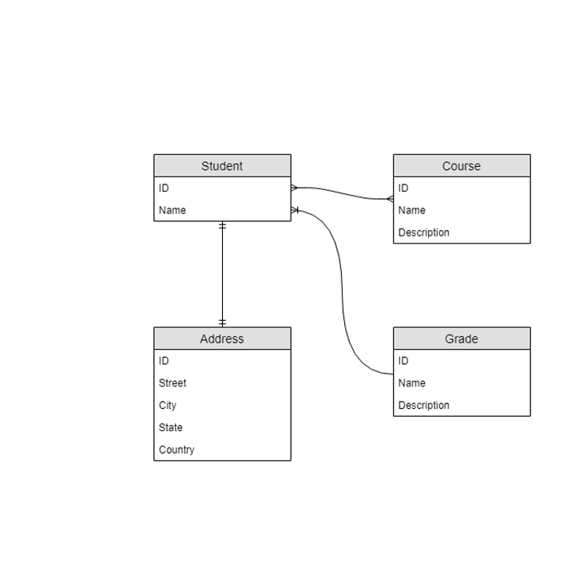

+++
### Example Schema
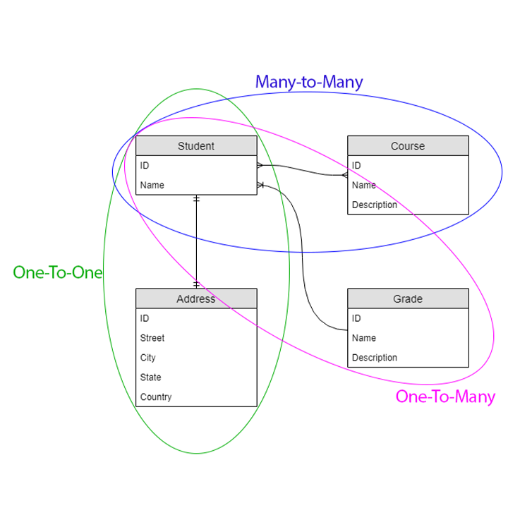

---
## Entity
* `class`/`record` in the domain of your application
* Included as a `DbSet<TEntity>` type property in the derived context class
* EF API **maps each entity to a table** and **each property of an entity to a column** in the database

```C#
public record CourseEntity
{
    public Guid Id { get; set; }
    public string Name { get; set; }
    public string Description { get; set; }

    public ICollection<StudentCourseEntity> StudentCourses { get; set; } = new List<StudentCourseEntity>();
}
```
or (beaware of `init` only properties)
```C#
public record CourseEntity(Guid Id, string Name, string Description)
{
    public ICollection<StudentCourseEntity> StudentCourses { get; init; } = new List<StudentCourseEntity>();
}
```

+++
### Entity in DbContext
* Classes become entities when they are **included as** `DbSet<TEntity>` properties **in a context class**
* Properties of type `DbSet<TEntity>` are called **entity sets**
* `AddressEntity`, `CourseEntity`, `GradeEntity`, `StudentEntity`, `StudentCourseEntity` are **entities** (also known as entity types)

```C#
public class SchoolDbContext : DbContext
{
    public SchoolDbContext(DbContextOptions options) : base(options)
    {
    }

    public DbSet<AddressEntity> Addresses => Set<AddressEntity>();
    public DbSet<CourseEntity> Courses => Set<CourseEntity>();
    public DbSet<GradeEntity> Grades => Set<GradeEntity>();
    public DbSet<StudentEntity> Students => Set<StudentEntity>();
    public DbSet<StudentCourseEntity> StudentCourses => Set<StudentCourseEntity>();
}
```

+++
### Entity Properties
* Entity can include **two types of properties**
  * **Scalar Property**
    * Primitive type properties
    * Stores the actual data
    * Maps to a **single column** in the database table
  * **Navigation Property**
    * **Represents a relationship** to another entity
    * Must be `virtual` in case you want to use Lazy Loading (not recommended), otherwise it needs to be `Include`d manually
    * OR, you may use manual *selection* or **Automapper**'s *projection*.
    * Two types
      * *Reference Navigation Property*
        * Includes a property of entity type
        * Represents multiplicity of one (1)
      * *Collection Navigation Property**
        * Includes a property of collection type
        * Represents multiplicity of many (*)

+++
<pre><code  data-sample='assets/sln/EntityFramework/School.DAL/Entities/StudentEntity.cs' data-sample-line-numbers="true" data-sample-indent="remove"></code></pre>

[Code sample](https://github.com/nesfit/ICS/blob/master/Lectures/Lecture_04/assets/sln/EntityFramework/School.DAL/Entities/StudentEntity.cs)

+++
### Entity Property Types
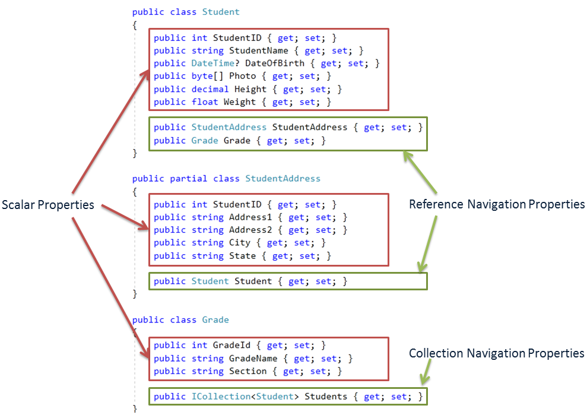 <!-- .element: class="stretch" -->

+++
### Entity types
* **POCO Entities (Plain Old CLR Object)**
  * Class that doesn't depend on any framework-specific base class
  * **Normal .NET CLR class**
  * "Persistence-ignorant objects"
* **Dynamic Proxy Entities (POCO Proxy)**
  * Runtime proxy class **which wraps POCO entity**
  * Allows **lazy loading**
  * By default, disabled
  * To enable, install `Microsoft.EntityFrameworkCore.Proxies`

```C#
protected override void OnConfiguring(DbContextOptionsBuilder optionsBuilder)
    => optionsBuilder
        .UseLazyLoadingProxies()
        .UseSqlServer(myConnectionString);
```
[Source](https://docs.microsoft.com/en-us/ef/core/querying/related-data#lazy-loading)

+++
### POCO Proxy Requirements
* POCO entity should meet the following requirements to become a POCO proxy:
  1. A POCO class must be declared with **public access**
  2. A POCO class must **not be sealed**
  3. A POCO class must **not be abstract**
  4. Each navigation **property** must be declared as **public, virtual**
  5. Each collection **property** must be `ICollection<T>`

+++
<pre><code  data-sample='assets/sln/EntityFramework/School.DAL.Tests/EntityTypesTest.cs' data-sample-line-numbers="true" data-sample-indent="remove"></code></pre>

<!-- +++?code=assets/sln/EntityFramework/School.DAL.Tests/EntityTypesTest.cs&lang=C#&title=Entity Types Sample
@[13-21]
@[23-29]
@[31-43]
@[45-56] -->
[Code sample](https://github.com/nesfit/ICS/blob/master/Lectures/Lecture_04/assets/sln/EntityFramework/School.DAL.Tests/EntityTypesTest.cs)

+++
### Entity states
* EF API maintains the state of each entity during an its lifetime
* **Each entity has a state** based on the operation performed on it via the *DbContext*
* Represented by an enum [`Microsoft.EntityFrameworkCore.EntityState`](https://docs.microsoft.com/en-us/ef/core/api/microsoft.entityframeworkcore.entitystate) (in EF Core)
* Tracking can be requested through `Entry()` method on `DbSet<>`
* Enum values
  1. *Added*
  2. *Modified*
  3. *Deleted*
  4. *Unchanged*
  5. *Detached*

+++
### Change Tracking
* *DbContext* keeps track of entity states and **maintains modifications** made to the properties of the entity
* Change from the *Unchanged* to the *Modified* is the only state that's **automatically handled by the** *DbContext*
* Other changes must be made **explicitly using** proper **methods of **`DbContext`** or **`DbSet`

+++
<pre><code  data-sample='assets/sln/EntityFramework/School.DAL.Tests/EntityStatesTest.cs' data-sample-line-numbers="true" data-sample-indent="remove"></code></pre>

<!-- +++?code=assets/sln/EntityFramework/School.DAL.Tests/EntityStatesTest.cs&lang=C#&title=Entity States Sample
@[12-24]
@[26-31]
@[33-39]
@[41-48]
@[50-57]
@[59-63] -->
[Code sample](https://github.com/nesfit/ICS/blob/master/Lectures/Lecture_04/assets/sln/EntityFramework/School.DAL.Tests/EntityStatesTest.cs)


+++
### Commands Building and Executing
* EF API builds and executes the **INSERT**, **UPDATE**, and **DELETE** commands based on the state of an entity when the `dbContext.SaveChanges()` is called
  * **INSERT** command for the entities with **Added** state
  * **UPDATE** command for the entities with **Modified** state
  * **DELETE** command for the entities in **Deleted** state
  * Context **does not track** entities in the **Detached** state


---
### DbContext
* Integral part of Entity Framework
* Instance **represents a session with the database**
* Can be **used to query and save instances of your entities to a database**
* Is a combination of the **Unit Of Work** and **Repository** patterns
* Allows us to perform following tasks:
  1. Manage database connection
  2. Configure model & relationship
  3. Querying database
  4. Saving data to the database
  5. Configure change tracking
  6. Caching
  7. Transaction management

+++
### DbContext Creation
* Class that derives from `DbContext` (known as context class)
* Typically includes `DbSet<TEntity>` properties for each entity in the model

```C#
public class SchoolDbContext : DbContext
{
    public SchoolDbContext(DbContextOptions options) : base(options)
    {
    }
    
    public DbSet<AddressEntity> Addresses => Set<AddressEntity>();
    public DbSet<CourseEntity> Courses => Set<CourseEntity>();
    public DbSet<GradeEntity> Grades => Set<GradeEntity>();
    public DbSet<StudentEntity> Students => Set<StudentEntity>();
    public DbSet<StudentCourseEntity> StudentCourses => Set<StudentCourseEntity>();

    protected override void OnModelCreating(ModelBuilder modelBuilder)
    {
    }
} 

+++

#### InMemory DbContext Creation

```C#
public class InMemoryDbContextFactory : IDbContextFactory
{
    public SchoolDbContext CreateDbContext()
    {
        var optionsBuilder = new DbContextOptionsBuilder<SchoolDbContext>();
        optionsBuilder.UseInMemoryDatabase("SchoolDb");
        return new SchoolDbContext(optionsBuilder.Options);
    }
}
```

+++
#### SqlServer DbContext Creation
* **Do NOT include connection string into the code!!!**
  
```C#
public class MSSQLLocalDBDbContextFactory : IDbContextFactory
{
    public SchoolDbContext CreateDbContext()
    {
        var optionsBuilder = new DbContextOptionsBuilder<SchoolDbContext>();
        optionsBuilder.UseSqlServer(
                @"Data Source=(LocalDB)\MSSQLLocalDB;Initial Catalog = SchoolDb;MultipleActiveResultSets = True;Integrated Security = True"); 
                //TODO never ever put connection string into the code!!! Use configuration always!
        return new SchoolDbContext(optionsBuilder.Options);
    }
}
```

+++
<pre><code  data-sample='assets/sln/Dapper.DAL/appconfig.json' data-sample-line-numbers="true" data-sample-indent="remove"></code></pre>
[Code sample](https://github.com/nesfit/ICS/blob/master/Lectures/Lecture_04/assets/sln/EntityFramework/School.DAL/appconfig.json)

+++
<pre><code  data-sample='assets/sln/EntityFramework/School.DAL/SchoolDbContext.cs' data-sample-line-numbers="true" data-sample-indent="remove"></code></pre>
<!-- @[9-30] -->
[Code sample](https://github.com/nesfit/ICS/blob/master/Lectures/Lecture_04/assets/sln/EntityFramework/School.DAL/SchoolDbContext.cs)

+++
<pre><code  data-sample='assets/sln/EntityFramework/School.DAL.Tests/LinqLazyEvaluationTest.cs' data-sample-line-numbers="true" data-sample-indent="remove"></code></pre>
<!-- @[13-21]
@[23-34] -->
[Code sample](https://github.com/nesfit/ICS/blob/master/Lectures/Lecture_04/assets/sln/EntityFramework/School.DAL.Tests/LinqLazyEvaluationTest.cs)

+++
### DbContext Methods
| Method          | Usage                                                                                                                                                                                              |
| --------------- | -------------------------------------------------------------------------------------------------------------------------------------------------------------------------------------------------- |
| *Add*           | Adds a new entity to `DbContext` with *Added* state and starts tracking it. This new entity data will be inserted into the database when `SaveChanges()` is called.                                |
| *AddAsync*      | Asynchronous method for adding a new entity to `DbContext` with *Added* state and starts tracking it. This new entity data will be inserted into the database when `SaveChangesAsync()` is called. |
| *AddRange*      | Adds a collection of new entities to `DbContext` with *Added* state and starts tracking it. This new entity data will be inserted into the database when `SaveChanges()` is called.                |
| *AddRangeAsync* | Asynchronous method for adding a collection of new entities which will be saved on `SaveChangesAsync()`.                                                                                           |

+++
### DbContext Methods
| Method        | Usage                                                                                                                             |
| ------------- | --------------------------------------------------------------------------------------------------------------------------------- |
| *Attach*      | Attaches a new or existing entity to `DbContext` with *Unchanged* state and starts tracking it.                                   |
| *AttachRange* | Attaches a collection of new or existing entities to `DbContext` with *Unchanged* state and starts tracking it.                   |
| *Entry*       | Gets an EntityEntry for the given entity. The entry provides access to change tracking information and operations for the entity. |
| *Find*        | Finds an entity with the given primary key values.                                                                                |
| *FindAsync*   | Asynchronous method for finding an entity with the given primary key values.                                                      |

+++
### DbContext Methods
| Method             | Usage                                                                                                                               |
| ------------------ | ----------------------------------------------------------------------------------------------------------------------------------- |
| *Remove*           | Sets Deleted state to the specified entity which will delete the data when `SaveChanges()` is called.                               |
| *RemoveRange*      | Sets Deleted state to a collection of entities which will delete the data in a single DB round trip when `SaveChanges()` is called. |
| *SaveChanges*      | Execute *INSERT*, *UPDATE* or *DELETE* command to the database for the entities with Added, Modified or Deleted state.              |
| *SaveChangesAsync* | Asynchronous method of `SaveChanges()`                                                                                              |

+++
### DbContext Methods
| Method            | Usage                                                                                                                                                                       |
| ----------------- | --------------------------------------------------------------------------------------------------------------------------------------------------------------------------- |
| *Set*             | Creates a `DbSet<TEntity>` that can be used to query and save instances of `TEntity`.                                                                                       |
| *Update*          | Attaches disconnected entity with Modified state and start tracking it. The data will be saved when `SaveChagnes()` is called.                                              |
| *UpdateRange*     | Attaches a collection of disconnected entities with Modified state and start tracking it. The data will be saved when `SaveChagnes()` is called.                            |
| *OnConfiguring*   | Override this method to configure the database (and other options) to be used for this context. This method is called for each instance of the context that is created.     |
| *OnModelCreating* | Override this method to further configure the model that was discovered by convention from the entity types exposed in `DbSet<TEntity>` properties on your derived context. |

+++
### DbContext Properties
| Property        | Usage                                                                                                               |
| --------------- | ------------------------------------------------------------------------------------------------------------------- |
| *ChangeTracker* | Provides access to information and operations for entity instances this context is tracking.                        |
| *Database*      | Provides access to database related information and operations for this context.                                    |
| *Model*         | Returns the metadata about the shape of entities, the relationships between them, and how they map to the database. |

---
### Persistence Scenarios - Connected Scenario
* Same instance of the context class (derived from DbContext) is used
* Keeps **track of all entities** during its lifetime
* Useful in local database or the database on the same network
* *Pros*
  * Performs fast
  * Track of all entities and automatically sets an appropriate state
* *Cons*
  * The context stays alive, so the connection with the database stays open
  * Utilizes more resource

+++
### Persistence Scenarios - Connected Scenario


+++
### Persistence Scenarios - Disconnected  Scenario
* **Used in this course**
* **Different instances of the context are used** to retrieve and save entities to the database
* Instance of the dbcontext is **disposed after retrieving data** and a new instance is created to save entities to the database
* Complex because an instance of the context does not track entities
* Useful in web applications or applications with a remote database
* *Pros*
  * Utilizes less resources compared to the connected scenario
  * No open connection with the database
* *Cons*
  * Need to set an appropriate state to each entity before saving
  * Performs slower than the connected scenario

+++
### Persistence Scenarios - Disconnected  Scenario


---
## Conventions
* **Default rules** to builds a model based on your domain 
  * **Tables** for all `DbSet<TEntity>` properties in a context class 
  * **Columns** for all the scalar properties of an entity class
  * **Not null** collumn by default
  * **Nullable** collumn by nullable primitive types properties
  * **Primary key** for property named `Id` or `<Entity Class Name>Id` (case insensitive)
  * **Foreign Key** for reference navigation property named
    * `<Reference Navigation Property Name>Id`
    * `<Reference Navigation Property Name><Principal Primary Key Property Name>`

+++
### C# to SQL Mapping
| C# Data Type              | SQL Data Type  |
| ------------------------- | -------------- |
| `int`                     | int            |
| `string`                  | nvarchar(Max)  |
| `decimal`                 | decimal(18,2)  |
| `float`                   | real           |
| `byte[]`                  | varbinary(Max) |
| `datetime`                | datetime       |
| `bool`                    | bit            |
| `byte`                    | tinyint        |
| `short`                   | smallint       |
| `long`                    | bigint         |
| `double`                  | float          |
| `char`, `sbyte`, `object` | No mapping     |

+++
### Foreign Key Convention


---
## Entity Configurations
* To **customize the entity to table mapping**
* When **do not want to follow default conventions**
* 2 ways
  * By using *Data Annotation Attributes*
  * By using *Fluent API*

+++
### Annotation Attributes
* Namespace `System.ComponentModel.DataAnnotations` and `System.ComponentModel.DataAnnotations`
* Simple **attribute based configuration method**
* .NET attributes can be **applied to domain classes and properties to configure the model**
* Also used in *ASP.NET MVC*

+++
### Annotation Attributes Sample
```C#
[Table("StudentInfo")]
public class Student
{
    public Student() { }
        
    [Key]
    public Guid ID { get; set; }

    [Column("Name", TypeName="ntext")]
    [MaxLength(20)]
    public string StudentName { get; set; }

    [NotMapped]
    public int? Age { get; set; }
        
        
    public int StdId { get; set; }

    [ForeignKey("StdId")]
    public virtual Standard Standard { get; set; }
}
```
<!-- @[1-2]
@[6-7]
@[9-11]
@[13-14]
@[17,19-20] -->

+++
### `System.ComponentModel.DataAnnotations.Schema` attributes
| Attribute           | Description                                                                     |
| ------------------- | ------------------------------------------------------------------------------- |
| `Table`             | The database table and/or schema that a class is mapped to                      |
| `Column`            | The database column that a property is mapped to                                |
| `ForeignKey`        | Specifies the property what is used as a foreign key in a relationship          |
| `DatabaseGenerated` | Specifies how the database generates values for a property                      |
| `NotMapped`         | Applied to properties or classes that are to be excluded from database mapping. |
| `InverseProperty`   | Specifies the inverse of a navigation property                                  |
| `Owned`             | Denotes that the class is a weak entity.                                        |

+++
### `System.ComponentModel.Annotations` attributes
| Attribute          | Description                                                             |
| ------------------ | ----------------------------------------------------------------------- |
| `Key`              | Identifies one or more properties as a Key                              |
| `Timestamp`        | Specifies the data type of the database column as `rowversion`          |
| `ConcurrencyCheck` | Specifies that the property is included in concurrency checks           |
| `Required`         | Specifies that the property's value is required                         |
| `MaxLength`        | Sets the maximum allowed length of the property value (string or array) |
| `StringLength`     | Sets the maximum allowed length of the property value (string or array) |

+++
### Fluent API
* Based on a *Fluent API* design pattern ([Fluent Interface](https://en.wikipedia.org/wiki/Fluent_interface))
* Result is formulated by [method chaining](https://en.wikipedia.org/wiki/Method_chaining)
* **ModelBuilder class** acts as a *Fluent API*
  * Provides **more configuration options than data annotation attributes**
* **Higher precedence than data annotation attributes**

+++
### Fluent API Configures
* **Model Configuration**
  * Configures an EF model to database mappings
  * Default Schema, DB functions, additional data annotation attributes and entities to be excluded from mapping
* **Entity Configuration**
  * Configures entity to table and relationships mapping 
  * e.g. PrimaryKey, AlternateKey, Index, table name, one-to-one, one-to-many, many-to-many relationships...
* **Property Configuration**
  * Configures property to column mapping 
  * e.g. column name, default value, nullability, Foreignkey, data type, concurrency column...

+++
### Fluent API Sample
```C#
public class SchoolDbContext: DbContext 
{
    public DbSet<StudentEntity> Students { get; set; }
        
    protected override void OnModelCreating(ModelBuilder modelBuilder)
    {
        //Write Fluent API configurations here

        //Property Configurations
        modelBuilder.Entity<StudentEntity>()
                .Property(s => s.StudentId)
                .HasColumnName("Id")
                .HasDefaultValue(0)
                .IsRequired();
    }
}
```

+++
### Model Configurations
| Fluent API Methods   | Usage                                                                |
| -------------------- | -------------------------------------------------------------------- |
| `HasDbFunction()`    | Configures a database function when targeting a relational database. |
| `HasDefaultSchema()` | Specifies the database schema.                                       |
| `HasAnnotation()`    | Adds or updates data annotation attributes on the entity.            |
| `HasSequence()`      | Configures a database sequence when targeting a relational database. |

+++
### Entity Configuration
| Fluent API Methods  | Usage                                                                                                                                                                 |
| ------------------- | --------------------------------------------------------------------------------------------------------------------------------------------------------------------- |
| `HasAlternateKey()` | Configures an alternate key in the EF model for the entity.                                                                                                           |
| `HasIndex()`        | Configures an index of the specified properties.                                                                                                                      |
| `HasKey()`          | Configures the property or list of properties as Primary Key.                                                                                                         |
| `HasMany()`         | Configures the Many part of the relationship, where an entity contains the reference collection property of other type for one-to-Many or many-to-many relationships. |
| `HasOne()`          | Configures the One part of the relationship, where an entity contains the reference property of other type for one-to-one or one-to-many relationships.               |
| `Ignore()`          | Configures that the class or property should not be mapped to a table or column.                                                                                      |
| `OwnsOne()`         | Configures a relationship where the target entity is owned by this entity. The target entity key value is propagated from the entity it belongs to.                   |
| `ToTable()`         | Configures the database table that the entity maps to.                                                                                                                |

+++
### Property Configuration part 1
| Fluent API Methods       | Usage                                                                                                                |
| ------------------------ | -------------------------------------------------------------------------------------------------------------------- |
| `HasColumnName()`        | Configures the corresponding column name in the database for the property.                                           |
| `HasColumnType()`        | Configures the data type of the corresponding column in the database for the property.                               |
| `HasComputedColumnSql()` | Configures the property to map to computed column in the database when targeting a relational database.              |
| `HasDefaultValue()`      | Configures the default value for the column that the property maps to when targeting a relational database.          |
| `HasDefaultValueSql()`   | Configures the default value expression for the column that the property maps to when targeting relational database. |
| `HasField()`             | Specifies the backing field to be used with a property.                                                              |
| `HasMaxLength()`         | Configures the maximum length of data that can be stored in a property.                                              |

+++
### Property Configuration part 2
| Fluent API Methods     | Usage                                                                                            |
| ---------------------- | ------------------------------------------------------------------------------------------------ |
| `IsConcurrencyToken()` | Configures the property to be used as an optimistic concurrency token.                           |
| `IsRequired()`         | Configures whether the valid value of the property is required or whether null is a valid value. |
| `IsRowVersion()`       | Configures the property to be used in optimistic concurrency detection.                          |
| `IsUnicode()`          | Configures the string property which can contain unicode characters or not.                      |

+++
### Property Configuration part 3
| Fluent API Methods              | Usage                                                                                  |
| ------------------------------- | -------------------------------------------------------------------------------------- |
| `ValueGeneratedNever()`         | Configures a property which cannot have a generated value when an entity is saved.     |
| `ValueGeneratedOnAdd()`         | Configures that the property has a generated value when saving a new entity.           |
| `ValueGeneratedOnAddOrUpdate()` | Configures that the property has a generated value when saving new or existing entity. |
| `ValueGeneratedOnUpdate()`      | Configures that a property has a generated value when saving an existing entity.       |


---
### DbContext Usage
 <!-- .element: class="overview" -->
* Insert Data
* Update Data
* Delete Data
* Query Data

+++
## Insert Data
```C#
var person = new Person
{
    FirstName = "Joe",
    LastName = "Doe"
};

using (var dbContext = CreateDbContext())
{
    dbContext.People.Add(person);
    dbContext.SaveChanges();
}
```

+++
## Update Data

```C#
person.LastName = "Smith";

using (var dbContext = CreateDbContext())
{
    dbContext.People.Update(person);
    dbContext.SaveChanges();
}
```

+++
## Delete Data
```C#
var person = new Person
{
    Id = 1
};

using (var dbContext = CreateDbContext())
{
    dbContext.People.Remove(person);
    dbContext.SaveChanges();
}
```

+++
## Query Data

* Any expresion created with LINQ
* When querying related object need to use `Include` expression

```C#
dbContext.Todos
    .Include(t => t.AssignedPerson) //Load also data for AssignedPerson
    .First(t => t.Id == todo.Id);
```

---
## Entity Relationships

 <!-- .element: class="overview" -->

* One-to-One
* One-to-Many
* Many-to-Many

* Just add them as properties, respect naming conventions
* Additional configuration of relationships can be done in `DbContext.OnModelCreating` method

+++
### One-to-One Relationships
* Default conventions
  * Reference **navigation property at both sides**
* Fluent Api
  * Only useful when foreign key **property does not follow the convention**

```C#
modelBuilder.Entity<StudentEntity>()
                .HasOne(i => i.Address)
                .WithOne()
                .HasForeignKey<StudentEntity>("AddressId");
```

+++
<pre><code  data-sample='assets/sln/EntityFramework/School.DAL/Entities/StudentEntity.cs' data-sample-line-numbers="true" data-sample-indent="remove"></code></pre>
[Code sample](https://github.com/nesfit/ICS/blob/master/Lectures/Lecture_04/assets/sln/EntityFramework/School.DAL/Entities/StudentEntity.cs)

+++
<pre><code  data-sample='assets/sln/EntityFramework/School.DAL/Entities/AddressEntity.cs' data-sample-line-numbers="true" data-sample-indent="remove"></code></pre>
[Code sample](https://github.com/nesfit/ICS/blob/master/Lectures/Lecture_04/assets/sln/EntityFramework/School.DAL/Entities/AddressEntity.cs)

+++
### One-to-Many Relationships
* Default conventions
  * There are more options
* Fluent Api

```C#
modelBuilder.Entity<StudentEntity>()
                .HasOne(i => i.Grade)
                .WithMany(i => i.Students)
                .HasForeignKey(i=>i.GradeId);
```

+++
### Default Convertions
* *1*

```C#
public class Student
{
    public Grade Grade { get; set; }
}

public class Grade{}
```

* *2*

```C#
public class Student{}

public class Grade
{
    public ICollection<Student> Students { get; set; } 
}
```

+++
### Default Convertions
* *3*

```C#
public class Student
{
    public Grade Grade { get; set; }
}

public class Grade
{
    public ICollection<Student> Students { get; set; }
}
```

* *4*

```C#
public class Student
{
    public int GradeId { get; set; }
    public Grade Grade { get; set; }
}
public class Grade
{
    public ICollection<Student> Students { get; set; }
}
```

+++
<pre><code  data-sample='assets/sln/EntityFramework/School.DAL/Entities/StudentEntity.cs' data-sample-line-numbers="true" data-sample-indent="remove"></code></pre>
[Code sample](https://github.com/nesfit/ICS/blob/master/Lectures/Lecture_04/assets/sln/EntityFramework/School.DAL/Entities/StudentEntity.cs)

+++
<pre><code  data-sample='assets/sln/EntityFramework/School.DAL/Entities/GradeEntity.cs' data-sample-line-numbers="true" data-sample-indent="remove"></code></pre>
[Code sample](https://github.com/nesfit/ICS/blob/master/Lectures/Lecture_04/assets/sln/EntityFramework/School.DAL/Entities/GradeEntity.cs)

+++
### Cascade Delete using Fluent API
* Automatically deletes the **dependant entity** when the related **principal entity** is deleted

```C#
modelBuilder.Entity<StudentEntity>()
                .HasOne(i => i.Grade)
                .WithMany(i => i.Students)
                .HasForeignKey(i=>i.GradeId)
                .OnDelete(DeleteBehavior.Cascade);
```

+++
### Many-to-Many Relationships
* In the database they are **represented by a joining table** which includes the foreign keys of both tables
* There are no default conventions
* Fluent Api

```C#
modelBuilder.Entity<StudentCourse>()
    .HasKey(sc => new { sc.StudentId, sc.CourseId });
```

+++
<pre><code  data-sample='assets/sln/EntityFramework/School.DAL/Entities/StudentEntity.cs' data-sample-line-numbers="true" data-sample-indent="remove"></code></pre>
[Code sample](https://github.com/nesfit/ICS/blob/master/Lectures/Lecture_04/assets/sln/EntityFramework/School.DAL/Entities/StudentEntity.cs)

+++
<pre><code  data-sample='assets/sln/EntityFramework/School.DAL/Entities/CourseEntity.cs' data-sample-line-numbers="true" data-sample-indent="remove"></code></pre>
[Code sample](https://github.com/nesfit/ICS/blob/master/Lectures/Lecture_04/assets/sln/EntityFramework/School.DAL/Entities/CourseEntity.cs)

+++
<pre><code  data-sample='assets/sln/EntityFramework/School.DAL/Entities/StudentCourseEntity.cs' data-sample-line-numbers="true" data-sample-indent="remove"></code></pre>
[Code sample](https://github.com/nesfit/ICS/blob/master/Lectures/Lecture_04/assets/sln/EntityFramework/School.DAL/Entities/StudentCourseEntity.cs)


---
## RAW SQL Queries
* `DbSet.FromSql()` - method to execute raw SQL queries


```C#
string name = "Bill";
var context = new SchoolDbContext();

var students = context.Students
              .FromSql($"Select * from Students where Name = '{name}'")
              .ToList();
```

+++
### RAW SQL Limitations
* SQL queries **must return entities of the same type** as `DbSet<T>` type, e.g., the specified query cannot return the `CourseEntity` entities if `FromSql()` is used after `Students`. Returning ad-hoc types from `FromSql()` method is in the backlog
* The SQL query **must return all the columns** of the table. e.g. `context.Students.FromSql("Select Id, Name from Students).ToList()` will throw an exception
* The SQL query **cannot include JOIN queries** to get related data. Use `Include` method to load related entities after `FromSql()` method.

---
## Migration
* Way to **keep the database schema in sync** with the EF Core model by preserving data
* Set of commands for
  * NuGet Package Manager Console (PMC)
  * Dotnet Command Line Interface (CLI)
* Requires `Microsoft.EntityFrameworkCore.Tools` NuGet package to be installed
* You have to implement `IDesignTimeDbContextFactory<TDbContext>` class


+++
### Migration commands
| PMC Command                    | CLI Command          | Usage                                                             |
| ------------------------------ | -------------------- | ----------------------------------------------------------------- |
| Add-Migration <migration name> | Add <migration name> | Creates a migration by adding a migration snapshot.               |
| Remove-Migration               | Remove               | Removes the last migration snapshot.                              |
| Update-Database                | Update               | Updates the database schema based on the last migration snapshot. |
| Script-Migration               | Script               | Generates a SQL script using all the migration snapshots.         |

---
## Dapper
* Simple object mapper for .NET
* **King of Micro ORM**
* Virtually as fast as using a raw ADO.NET data reader
* **Extends the IDbConnection** by providing useful extension methods to query your database
* `PM> Install-Package Dapper`
* [Tutorial](https://dapper-tutorial.net)

+++
### How Dapper works
* Works with **any database provider** since **there is no DB specific implementation**
* Three step process:
  1. *Create an `IDbConnection` object**
  2. *Write a query to perform CRUD operations*
  3. *Pass query as a parameter in Execute method*

+++
<pre><code  data-sample='assets/sln/Dapper.DAL/Entities/StudentEntity.cs' data-sample-line-numbers="true" data-sample-indent="remove"></code></pre>
[Code sample](https://github.com/nesfit/ICS/blob/master/Lectures/Lecture_04/assets/sln/Dapper.DAL/Entities/StudentEntity.cs)

+++
<pre><code  data-sample='assets/sln/Dapper.DAL/StudentRepository.cs' data-sample-line-numbers="true" data-sample-indent="remove"></code></pre>
<!-- @[20-30]
@[32-42]
@[44-53]
@[55-64] -->
[Code sample](https://github.com/nesfit/ICS/blob/master/Lectures/Lecture_04/assets/sln/Dapper.DAL/StudentRepository.cs)

+++
<pre><code  data-sample='assets/sln/Dapper.DAL.Tests/StudentRepositoryTests.cs' data-sample-line-numbers="true" data-sample-indent="remove"></code></pre>
<!-- @[12-28] -->
[Code sample](https://github.com/nesfit/ICS/blob/master/Lectures/Lecture_04/assets/sln/Dapper.DAL.Tests/StudentRepositoryTests.cs)

---
## NHibernate
* Object-relational mapper
* **Open source**
* Uses XML files and attributes for configuration
* Functionality is simmilar to Entity Framework
* `PM> Install-Package NHibernate`
* [Documentation](https://nhibernate.info/doc/index.html)
* [GitHub](https://github.com/nhibernate/nhibernate-core)

---
## ORM Performance Benchmarking
* Tested technologies:
  * **Entity Framework** representing "big" ORM
  * **Dapper** representing "micro" ORM
  * **ADO.NET** for straight queries

[Source](https://github.com/exceptionnotfound/ORMBenchmarksTest)

+++
### Performance Benchmarking Methodology  - Schema


+++
### Performance Benchmarking - Methodology  - Sample data
* Used algorithms to create
* You **can select**
  * How many *sports* you want for each test
  * How many *teams per sport* you want for each test
  * How many *players per team* you want for each test

+++
### Performance Benchmarking Methodology  - Queries
* **Queries**
  * Player by ID
  * Players per Team
  * Teams per Sport (including Players)
* Run the **test against all data** in the database
  * **Average the total time** it takes to execute the query
    * **Multiple runs** of this over the same data
      * Average them out and get a set of numbers that should show which of the ORMs is the fastest

+++
### Performance Benchmarking test class - Entity Framework
```C#
public class EntityFramework : ITestSignature
{
    public long GetPlayerByID(int id)
    {
        Stopwatch watch = new Stopwatch();
        watch.Start();
        using (SportContext context = new SportContext())
        {
            var player = context.Players.Where(x => x.Id == id).First();
        }
        watch.Stop();
        return watch.ElapsedMilliseconds;
    }

    public long GetPlayersForTeam(int teamId)
    {
        Stopwatch watch = new Stopwatch();
        watch.Start();
        using (SportContext context = new SportContext())
        {
            var players = context.Players.Where(x => x.TeamId == teamId).ToList();
        }
        watch.Stop();
        return watch.ElapsedMilliseconds;
    }

    public long GetTeamsForSport(int sportId)
    {
        Stopwatch watch = new Stopwatch();
        watch.Start();
        using (SportContext context = new SportContext())
        {
            var players = context.Teams.Include(x=>x.Players).Where(x => x.SportId == sportId).ToList();
        }
        watch.Stop();
        return watch.ElapsedMilliseconds;
    }
}
```
[Code sample](https://github.com/exceptionnotfound/ORMBenchmarksTest/blob/master/ORMBenchmarksTest/DataAccess/EntityFramework.cs)

+++
### Performance Benchmarking test class - ADO.NET
```C#
public class ADONET : ITestSignature
{
    public long GetPlayerByID(int id)
    {
        Stopwatch watch = new Stopwatch();
        watch.Start();
        using(SqlConnection conn = new SqlConnection(Constants.ConnectionString))
        {
            conn.Open();
            using(SqlDataAdapter adapter = new SqlDataAdapter("SELECT Id, FirstName, LastName, DateOfBirth, TeamId FROM Player WHERE Id = @ID", conn))
            {
                adapter.SelectCommand.Parameters.Add(new SqlParameter("@ID", id));
                DataTable table = new DataTable();
                adapter.Fill(table);
            }
        }
        watch.Stop();
        return watch.ElapsedMilliseconds;
    }

    public long GetPlayersForTeam(int teamId)
    {
        Stopwatch watch = new Stopwatch();
        watch.Start();
        using(SqlConnection conn = new SqlConnection(Constants.ConnectionString))
        {
            conn.Open();
            using(SqlDataAdapter adapter = new SqlDataAdapter("SELECT Id, FirstName, LastName, DateOfBirth, TeamId FROM Player WHERE TeamId = @ID", conn))
            {
                adapter.SelectCommand.Parameters.Add(new SqlParameter("@ID", teamId));
                DataTable table = new DataTable();
                adapter.Fill(table);
            }
        }
        watch.Stop();
        return watch.ElapsedMilliseconds;
    }

    public long GetTeamsForSport(int sportId)
    {
        Stopwatch watch = new Stopwatch();
        watch.Start();
        using(SqlConnection conn = new SqlConnection(Constants.ConnectionString))
        {
            conn.Open();
            using(SqlDataAdapter adapter = new SqlDataAdapter("SELECT p.Id, p.FirstName, p.LastName, p.DateOfBirth, p.TeamId, t.Id as TeamId, t.Name, t.SportId FROM Player p INNER JOIN Team t ON p.TeamId = t.Id WHERE t.SportId = @ID", conn))
            {
                adapter.SelectCommand.Parameters.Add(new SqlParameter("@ID", sportId));
                DataTable table = new DataTable();
                adapter.Fill(table);
            }
        }
        watch.Stop();
        return watch.ElapsedMilliseconds;
    }
}
```
[Code sample](https://github.com/exceptionnotfound/ORMBenchmarksTest/blob/master/ORMBenchmarksTest/DataAccess/ADONET.cs)

+++
### Performance Benchmarking test class - Dapper
```C#
public class Dapper : ITestSignature
{
    public long GetPlayerByID(int id)
    {
        Stopwatch watch = new Stopwatch();
        watch.Start();
        using (SqlConnection conn = new SqlConnection(Constants.ConnectionString))
        {
            conn.Open();
            var player = conn.Query<PlayerDTO>("SELECT Id, FirstName, LastName, DateOfBirth, TeamId FROM Player WHERE Id = @ID", new{ ID = id});
        }
        watch.Stop();
        return watch.ElapsedMilliseconds;
    }

    public long GetPlayersForTeam(int teamId)
    {
        Stopwatch watch = new Stopwatch();
        watch.Start();
        using (SqlConnection conn = new SqlConnection(Constants.ConnectionString))
        {
            conn.Open();
            var players = conn.Query<List<PlayerDTO>>("SELECT Id, FirstName, LastName, DateOfBirth, TeamId FROM Player WHERE TeamId = @ID", new { ID = teamId });
        }
        watch.Stop();
        return watch.ElapsedMilliseconds;
    }

    public long GetTeamsForSport(int sportId)
    {
        Stopwatch watch = new Stopwatch();
        watch.Start();
        using (SqlConnection conn = new SqlConnection(Constants.ConnectionString))
        {
            conn.Open();
            var players = conn.Query<PlayerDTO, TeamDTO, PlayerDTO>("SELECT p.Id, p.FirstName, p.LastName, p.DateOfBirth, p.TeamId, t.Id as TeamId, t.Name, t.SportId FROM Team t "
                + "INNER JOIN Player p ON t.Id = p.TeamId WHERE t.SportId = @ID", (player, team) => { return player; }, splitOn: "TeamId", param: new { ID = sportId });
        }
        watch.Stop();
        return watch.ElapsedMilliseconds;
    }
}
```
[Code sample](https://github.com/exceptionnotfound/ORMBenchmarksTest/blob/master/ORMBenchmarksTest/DataAccess/Dapper.cs)

+++
### Performance Benchmarking results
* Following results are for
  * **10 iterations** each containg
    * **8 sports**
    * **30 teams** in each sport
    * **100 players** per team

+++
### Performance Benchmarking results - Entity Framework
| RUN         | PLAYER BY ID | PLAYERS FOR TEAM | TEAMS FOR SPORT |
| ----------- | ------------ | ---------------- | --------------- |
| **1**       | 1.64ms       | 4.57ms           | 127.75ms        |
| **2**       | 0.56ms       | 3.47ms           | 112.5ms         |
| **3**       | 0.17ms       | 3.27ms           | 119.12ms        |
| **4**       | 1.01ms       | 3.27ms           | 106.75ms        |
| **5**       | 1.15ms       | 3.47ms           | 107.25ms        |
| **6**       | 1.14ms       | 3.27ms           | 117.25ms        |
| **7**       | 0.67ms       | 3.27ms           | 107.25ms        |
| **8**       | 0.55ms       | 3.27ms           | 110.62ms        |
| **9**       | 0.37ms       | 4.4ms            | 109.62ms        |
| **10**      | 0.44ms       | 3.43ms           | 116.25ms        |
| **Average** | **0.77ms**   | **3.57ms**       | **113.45ms**    |


+++
### Performance Benchmarking results - ADO.NET
| RUN         | PLAYER BY ID | PLAYERS FOR TEAM | TEAMS FOR SPORT |
| ----------- | ------------ | ---------------- | --------------- |
| **1**       | 0.01ms       | 1.03ms           | 10.25ms         |
| **2**       | 0ms          | 1ms              | 11ms            |
| **3**       | 0.1ms        | 1.03ms           | 9.5ms           |
| **4**       | 0ms          | 1ms              | 9.62ms          |
| **5**       | 0ms          | 1.07ms           | 7.62ms          |
| **6**       | 0.02ms       | 1ms              | 7.75ms          |
| **7**       | 0ms          | 1ms              | 7.62ms          |
| **8**       | 0ms          | 1ms              | 8.12ms          |
| **9**       | 0ms          | 1ms              | 8ms             |
| **10**      | 0ms          | 1.17ms           | 8.88ms          |
| **Average** | **0.013ms**  | **1.03ms**       | **8.84ms**      |

+++
### Performance Benchmarking results - Dapper
| RUN         | PLAYER BY ID | PLAYERS FOR TEAM | TEAMS FOR SPORT |
| ----------- | ------------ | ---------------- | --------------- |
| **1**       | 0.38ms       | 1.03ms           | 9.12ms          |
| **2**       | 0.03ms       | 1ms              | 8ms             |
| **3**       | 0.02ms       | 1ms              | 7.88ms          |
| **4**       | 0ms          | 1ms              | 8.12ms          |
| **5**       | 0ms          | 1.07ms           | 7.62ms          |
| **6**       | 0.02ms       | 1ms              | 7.75ms          |
| **7**       | 0ms          | 1ms              | 7.62ms          |
| **8**       | 0ms          | 1.02ms           | 7.62ms          |
| **9**       | 0ms          | 1ms              | 7.88ms          |
| **10**      | 0.02ms       | 1ms              | 7.75ms          |
| **Average** | **0.047ms**  | **1.01ms**       | **7.94ms**      |

+++
### Performance Benchmarking analysis and conclusion
* *Entity Framework* in *basic configuration* is 3-10 times **slower** than either *ADO.NET* or *Dapper*
* *Dapper.NET* is unquestionably **faster** than *Entity Framework* and slightly faster than straight *ADO.NET*


---

# Repository, UnitOfWork, Facade and Mapper design patterns
## Mapping Entities to Models

---
## Repository
* Mediates **between the domain and data mapping layers**
* Acting like an **in-memory collection** of domain objects 


+++
### Repository Benefits
* **Minimizes duplicit** query logic
* **Decouples** application from persistence frameworks
* Promotes **testability**

+++
### Repository Responsibility
* **Add** *object*
* **Remove** *object*
* **Get** *object* by *ID*
* **Get all** *objects*
* **Find** using *predicate*

+++
### Repository vs UnitOfWork
* **Repository** design pattern
  * Should **not have sematics of database**
  * E.g. *Update*, *Save*, *Delete*... 
* How are these objects going to be saved to database?
  * **UnitOfWork** design pattern

+++
<pre><code  data-sample='assets/sln/EntityFramework/School.DAL/Repositories/RepositoryBase.cs' data-sample-line-numbers="true" data-sample-indent="remove"></code></pre>
[Code sample](https://github.com/nesfit/ICS/blob/master/Lectures/Lecture_04/assets/sln/EntityFramework/School.DAL/Repositories/RepositoryBase.cs)

---
## UnitOfWork
* Maintains a list of objects affected by a business transaction
* Coordinates the writing out of changes


+++
<pre><code  data-sample='assets/sln/EntityFramework/School.DAL/UnitOfWork/UnitOfWork.cs' data-sample-line-numbers="true" data-sample-indent="remove"></code></pre>
[Code sample](https://github.com/nesfit/ICS/blob/master/Lectures/Lecture_04/assets/sln/EntityFramework/School.DAL/UnitOfWork/UnitOfWork.cs)

---
### Entity Framework as UnitOfWork and Repository
* *UnitOfWork* and *Repository* are **already implemented** in *Entity Framework*
* **Do not bring the architectural benefits** from these patterns


+++
### Entity Framework Problems
* *Repository*
  * **Minimizes duplicit** query logic
* *Entity Framework*
  * `DbSet` returns `IQueriable`
  * Does not help with minimizing the duplicate:

```C#
var topSellingCourses = schoolCourses.Where(c => c.IsPublic && c.IsApproved).OrderByDescending(c => c.Sales).Take(10);
```

* Can be solved with **extension methods**
  * Treats the symptoms, not the problem
  * Still returns `IQueryable`
* **Solution**
  * **Repository** with method `GetTopSellingCourses`

+++
### Entity Framework Problems
* *Repository and UnitOfWork*
  * **Decouples** application from persistence frameworks
  * Only **repository methods have to be changed** when switching to different ORM
* *Entity Framework*
  * Application is **tightly coupled** to Entity Framework
  * Aplication **code has to be directly upgraded** when switching to different ORM


---
## Mapper
* **Object-object**
* **Mapping**
  * **Same properties**
  * From *one object* of *one type*
  * To *another object* of *another type*
* E.g. `entity` to the `model/DTO`


+++
#### Mapper School Sample
* Mapping *Entity Framework entities* to *models*
* **Model**
  * Part of *Model-View-ViewModel(MVVM)* design pattern
  * Represents the **actual data and information**

+++
<pre><code  data-sample='assets/sln/EntityFramework/School.BL/Mappers/IMapper.cs' data-sample-line-numbers="true" data-sample-indent="remove"></code></pre>
[Code sample](https://github.com/nesfit/ICS/blob/master/Lectures/Lecture_04/assets/sln/EntityFramework/School.BL/Mappers/IMapper.cs)

+++
<pre><code  data-sample='assets/sln/EntityFramework/School.BL/Models/DetailModels/AddressDetailModel.cs' data-sample-line-numbers="true" data-sample-indent="remove"></code></pre>
[Code sample](https://github.com/nesfit/ICS/blob/master/Lectures/Lecture_04/assets/sln/EntityFramework/School.BL/DetailModels/AddressDetailModel.cs)

+++
<pre><code  data-sample='assets/sln/EntityFramework/School.BL/Mappers/AddressMapper.cs' data-sample-line-numbers="true" data-sample-indent="remove"></code></pre>
[Code sample](https://github.com/nesfit/ICS/blob/master/Lectures/Lecture_04/assets/sln/EntityFramework/School.BL/Mappers/AddressMapper.cs)

+++
<pre><code  data-sample='assets/sln/EntityFramework/School.BL/Models/ListModels/StudentListModel.cs' data-sample-line-numbers="true" data-sample-indent="remove"></code></pre>
[Code sample](https://github.com/nesfit/ICS/blob/master/Lectures/Lecture_04/assets/sln/EntityFramework/School.BL/Models/ListModels/StudentListModel.cs)

+++
<pre><code  data-sample='assets/sln/EntityFramework/School.BL/Models/DetailModels/StudentDetailModel.cs' data-sample-line-numbers="true" data-sample-indent="remove"></code></pre>
[Code sample](https://github.com/nesfit/ICS/blob/master/Lectures/Lecture_04/assets/sln/EntityFramework/School.BL/Models/DetailModels/StudentDetailModel.cs)

+++
<pre><code  data-sample='assets/sln/EntityFramework/School.BL/Mappers/StudentMapper.cs' data-sample-line-numbers="true" data-sample-indent="remove"></code></pre>
[Code sample](https://github.com/nesfit/ICS/blob/master/Lectures/Lecture_04/assets/sln/EntityFramework/School.BL/Mappers/StudentMapper.cs)

---

 <!-- .element: class="overview" -->
* `PM> Install-Package AutoMapper`
* [Github](https://github.com/AutoMapper/AutoMapper)
* [Web](http://automapper.org/)
* [Docs](https://automapper.readthedocs.io/en/latest/index.html)


+++
### Auto Mapper
* Automatic **object-object mapping**
  * **Same properties**
  * From *one object* of *one type*
  * To *another object* of *another type*
* Interesting **conventions to take the dirty work out**
* Almost zero configuration is needed 

+++
### Why AutoMapper
* Mapping code is boring
* Testing the mapping code is even more boring
* *Provides:*
  * **Simple configuration of types**
  * **Simple testing of mappings**

+++
### How to Use AutoMapper
1. **Create source and destination** types
  * AutoMapper works best as long as the names of the members match up to the source type’s members
    * Source member called `FirstName` will automatically be mapped to a destination member with the name `FirstName`
  * Automapper by default ignores null reference exceptions when mapping your source to your target
2. **Create a map for the two types**
3. **Perform mapping**

+++
### Create a map for the two types
* On the *left* is *source type*
* On the *right* is *destination type*

```
Mapper.Initialize(cfg => cfg.CreateMap<Order, OrderDto>());
//or
var config = new MapperConfiguration(cfg => cfg.CreateMap<Order, OrderDto>());
```

+++
### Perform mapping

```
OrderDto dto = Mapper.Map<OrderDto>(order);

//or

var mapper = config.CreateMapper();
// or
var mapper = new Mapper(config);

OrderDto dto = mapper.Map<OrderDto>(order);
```

+++
### How to test Mapping
* **Create a test** that
  * Calls *bootstrapper class to create all the mappings*
  * Calls *MapperConfiguration.AssertConfigurationIsValid*

```C#
var config = AutoMapperConfiguration.Configure();

config.AssertConfigurationIsValid();
```

+++
### AutoMapper Supports
* **Flattening**
  * Take a complex object model and flatten it to a simpler model
* **Reverse Mapping** and **Unflattening**
  * Calling `ReverseMap`, *AutoMapper* creates a reverse mapping configuration that includes unflattening
* **Projection**
* **Configuration Validation**
* **Inline Mapping**
* **Nested Mapping**
* Custom **Converters**, **Resolvers**
* ⋮

---
## Facade
* **Provides a unified interface** to the set of interfaces in a subsystem
* **Higher-level interface** that makes the subsystem easier to use


+++
### Facade Participants
* **Facade**
  * Knows which subsystem classes are responsible for a request
  * **Delegates client requests** to appropriate subsystem objects
* **Subsystem classes**
  * **Implement subsystem functionality**
  * Handle work assigned by the Facade object
  * Have no knowledge of the facade and keep no reference to it

+++
<pre><code  data-sample='assets/sln/EntityFramework/School.BL/Facades/CrudFacadeBase.cs' data-sample-line-numbers="true" data-sample-indent="remove"></code></pre>


[Code sample](https://github.com/nesfit/ICS/blob/master/Lectures/Lecture_04/assets/sln/EntityFramework/School.BL/Facades/CrudFacadeBase.cs)

+++
<pre><code  data-sample='assets/sln/EntityFramework/School.BL.Tests/AddressFacadeTests.cs' data-sample-line-numbers="true" data-sample-indent="remove"></code></pre>
[Code sample](https://github.com/nesfit/ICS/blob/master/Lectures/Lecture_04/assets/sln/EntityFramework/School.BL.Tests/AddressFacadeTests.cs)

+++
<pre><code  data-sample='assets/sln/EntityFramework/School.BL.Tests/StudentFacadeTests.cs' data-sample-line-numbers="true" data-sample-indent="remove"></code></pre>
[Code sample](https://github.com/nesfit/ICS/blob/master/Lectures/Lecture_04/assets/sln/EntityFramework/School.BL.Tests/StudentFacadeTests.cs)

---
## References:
[C# 8.0 in a Nutshell: The Definitive Reference](https://www.amazon.com/C-8-0-Nutshell-Definitive-Reference/dp/1492051136) 
[EntityFrameworkTutorial.net](http://www.entityframeworktutorial.net/)  
[Learn Entity Framework Core](https://www.learnentityframeworkcore.com)
[Dapper-tutorial.net](https://dapper-tutorial.net/)
[Microsoft documentation](https://docs.microsoft.com)  
[Entity Framework GitHub](https://github.com/aspnet/EntityFrameworkCore)  
[NuGetMustHaves.com](https://nugetmusthaves.com/)  
[Computer Hope](https://www.computerhope.com)  
[Wikipedia](https://en.wikipedia.org)

+++
## Refences to used images:
[EntityFrameworkTutorial.net](http://www.entityframeworktutorial.net/)  
[The Inquisitive Singh](https://inquisitivesingh.wordpress.com)  
[Exception Not Found](https://exceptionnotfound.net/)  
[INTELLIPAAT.COM](https://intellipaat.com/)  
[Computer Hope](https://www.computerhope.com)  
[Wikipedia SQL](https://en.wikipedia.org/wiki/SQL)  
[ResearchGate](https://www.researchgate.net/)  
[Data36](https://data36.com/)

+++
## Credits
* Michal Mrnuštík - for slides preparation
* Michal Orlíček - for slides preparation

---

<!-- Has to stay, because otherwise static build would not contain logo resources referenced in CSS theme -->

+++
